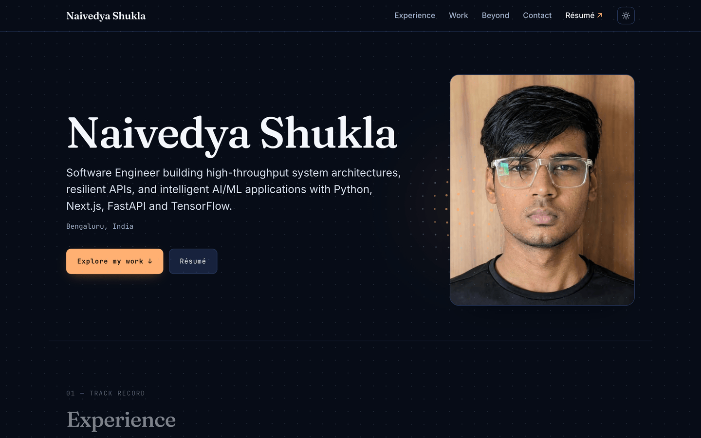

# Naivedya Shukla — Portfolio

Personal portfolio site with a grounded AI assistant that answers recruiter
questions about my work from a curated corpus, built on Next.js 16 and React 19.

**Live: [naivedya-shukla.vercel.app](https://naivedya-shukla.vercel.app)**

[](https://github.com/navyyshukla/Portfolio-Website/actions/workflows/ci.yml)
[](https://nextjs.org)
[](https://www.typescriptlang.org)
[](LICENSE)



## What it is

A portfolio for **Naivedya Shukla**, a software engineer in Bengaluru, India.
The audience is recruiters, and that decides the architecture: the homepage
delivers everything it has to say without a single interaction — no click-to-
reveal, no scroll-jacked reveal sequence, nothing personal or extracurricular
competing with the work.

The part worth reading the source for is the assistant. Visitors can ask it
about my experience and projects, and it answers from a corpus assembled out of
this repo's own content files. There is no vector store, no AI SDK and no
database — the retrieval is ~130 lines of IDF-weighted term overlap, because the
binding constraint is free-tier tokens per day, not recall.

## Features

- **Homepage** — Hero → Experience → Selected Work → Skills → Contact, all
  static
- **Case studies** at `/work/[slug]` — four, statically generated, each with a
  poster that only fetches its hover clip on hover
- **The full catalogue** at `/projects` — every project with a README, each on
  its own page. The ones that were never deployed get a cover generated from a
  hash of their slug: inline SVG, zero JS, zero image bytes, and it re-themes
  with the site
- **`/ask`** — a streaming assistant console, plus a docked non-modal popup
  available site-wide
- **`/beyond-code`** — interests, and an isometric Three.js path that walks
  through life milestones (loaded via `next/dynamic`, never on `/`)
- **`/resume`** — an embedded PDF viewer with its own zoom, reset, download and
  expand controls
- **⌘K command palette**, a theme that follows the OS until you override it, and
  a full-viewport dot field with a cursor spotlight and click ripples
- **Motion is opt-out everywhere** — every animation gates on
  `prefers-reduced-motion`, and hover clips render no `<video>` element at all
  on touch devices or under reduced motion

## Tech stack

| Layer | Choice |
| --- | --- |
| Framework | Next.js 16 (App Router, SSG — one dynamic route in the whole build) |
| UI | React 19, TypeScript 5 strict |
| Styling | Tailwind v4 via the PostCSS plugin — no `tailwind.config` |
| 3D | Three.js, dynamically imported on `/beyond-code` only |
| Interaction | Lenis (smooth scroll), cmdk (command palette) |
| LLM | Groq and Google AI Studio free tiers, called with plain `fetch` |
| State / limits | Upstash Redis (rate limiting + daily token budget) |
| Hosting | Vercel, with Web Analytics |

There is deliberately **no AI SDK**. `src/lib/llm.ts` posts to
OpenAI-compatible endpoints directly — it is less code than the adapter would
be, and it keeps the provider-fallback logic somewhere I can read it.

## Quick start

Requires **Node ≥ 22.6** — `npm run eval:retrieval` imports the TypeScript
corpus directly using `--experimental-strip-types`, which does not exist before
22.6.

```bash
git clone https://github.com/navyyshukla/Portfolio-Website.git
cd Portfolio-Website
npm install
cp .env.example .env.local   # optional — see below
npm run dev
```

Open <http://localhost:3000>.

**The site runs with no API keys at all.** With no provider key set, `/api/chat`
returns 503 and the assistant UI tells visitors to email instead; every page,
route and interaction otherwise works exactly as in production.

## Scripts

| Command | What it does |
| --- | --- |
| `npm run dev` | Development server |
| `npm run build` | Production build |
| `npm start` | Serve the production build |
| `npm run typecheck` | `tsc --noEmit` |
| `npm run lint` | ESLint |
| `npm run analyze` | Build with the bundle analyzer treemap |
| `npm run sync:github` | Regenerate `src/content/repos.ts` from public GitHub repos |
| `npm run capture:shots` | Re-record project posters and hover clips from live deployments |
| `npm run eval:retrieval` | Retrieval cases + prompt token budget |

`src/content/repos.ts` is **generated**. Edit `scripts/sync-github.mjs` or
promote the entry into a real case study in `projects.ts` — hand edits are lost
on the next sync.

## How the assistant works

### Retrieval without a vector store

`src/lib/retrieval.ts` scores documents by IDF-weighted term overlap. A term
hitting a document's strong fields — title, slug, category, stack, keywords —
counts triple; a hit in body prose counts single. Question words that carry no
signal are dropped by a stopword list, and a match has to clear both a relative
floor (`0.34` of the best score) and an absolute floor (`1.2`), so a weak match
attaches nothing rather than noise.

That stopword list is a ranking aid, never a content filter: it decides which
documents get attached, never whether a question gets answered.

No embeddings, no vector database, no network call, no cold start. It is
deterministic, which means it can be tested — and it is, on every push.

### A corpus gated by relevance

`src/lib/corpus.ts` assembles the prompt in two layers:

- **Core**, always sent: identity, experience, education, skills, and a
  one-line index of *every* project. 1,555 tokens.
- **Documents**, sent only when they match: full case studies, repo detail,
  interests. At most `MAX_DOCUMENTS = 3`, inside a
  `DETAIL_TOKEN_BUDGET = 1250`.

Because the index of every project always ships, a retrieval miss costs depth,
never existence — the assistant still knows the project is there and can name
it.

### Why gate it at all

The prompt is resent on every single call, so **prompt size is the capacity
budget**. On the free tier it is tokens per day that bind, not requests:

| Model | Role | RPM | TPM | Tokens/day |
| --- | --- | --- | --- | --- |
| `llama-3.3-70b-versatile` | primary | 30 | 12,000 | 100,000 |
| `llama-3.1-8b-instant` | overflow | 30 | 6,000 | 500,000 |

At the current peak prompt of 2,687 tokens that is roughly **28 questions a day**
on the primary model before overflow takes over. Sending the whole corpus every
time would cut that by more than half. Every token added to the corpus is taken
directly out of a visitor's answer.

### Provider chain

Groq `llama-3.3-70b-versatile` → Groq `llama-3.1-8b-instant` when the daily
budget tightens → Google `gemini-flash-latest` only on 429/5xx. Gemini is last
on purpose: its free tier is marked as used to improve Google's products, which
means visitor questions sent there become training data.

### Guardrails

Scope is enforced by a **positive allowlist** plus an explicit
anti-over-refusal clause in the system prompt — never a keyword blacklist or an
injection classifier, both of which reliably over-refuse on real recruiter
questions. The assistant has **no tools and no database access**, and
`corpus.ts` and `retrieval.ts` both carry `import "server-only"`, which is what
stops the corpus from ever being pulled into a client bundle.

Per-IP and global rate limits run on Upstash (with an in-memory fallback when
it is not configured) *before* request validation, so a flood costs no provider
tokens. A daily token counter shrinks the answer cap as spend rises rather than
cutting visitors off. The 1,000-character input cap applies to visitor messages
only — applying it to assistant turns, which the client resends as history,
413'd every follow-up after a long answer.

### Testing it

```bash
npm run eval:retrieval
```

28 questions and 2 negative cases, each asserting the document it must (or must
not) pull. It fails on a retrieval miss or a token-budget breach, and it runs in
CI on every push. Current: core 1,555t, prompt mean 2,111t, peak 2,687t against
a 2,800t budget — so the core layer has 45 tokens of headroom, and the next
project promoted to a case study will need something else shortened first.

## Performance

`/` ships **170.3 KB of first-load JS gzipped** across 15 chunks, against a
self-imposed 200 KB cap. What keeps it there:

- Three.js, Lenis, `react-markdown` and the entire chat UI are behind
  `next/dynamic` and never reach `/`
- `'use client'` sits on leaf components only, never a section wrapper
- Images are AVIF; `/` fetches 26.4 KB on load (the hero portrait), with project
  posters arriving on scroll
- Hover clips fetch **zero bytes** until hovered, and are never rendered on
  touch or under reduced motion
- Generated covers are inline SVG in a server component — no image request, no
  client JavaScript, and nothing to 404

To re-measure: `npm run build && npm start`, then sum the gzipped chunks `/`
requests. `npm run analyze` gives the treemap.

## Project structure

```
src/
  app/            routes, metadata, sitemap/robots/OG image; one API route
  components/
    sections/     homepage sections
    ui/           nav, footer, palette, theme toggle, dot field, media
    ask/          assistant console, popup, hooks
    story/        the Three.js story path
  content/        all user-facing copy (repo-notes.ts curates the generated repos.ts)
  lib/            corpus, retrieval, guardrails, llm, budget, ratelimit, seo, catalog
scripts/          github sync, shot capture, retrieval eval
public/           résumé PDF, portrait, project posters and clips
```

**Every user-facing string lives in `src/content/**`.** Components hardcode
none. `src/content/profile.ts` holds identity and the site origin — that origin
is defined once and every canonical URL, sitemap entry and OG tag derives from
it.

## Configuration

All variables are optional; see [`.env.example`](.env.example) for the full
annotated list.

| Variable | Purpose |
| --- | --- |
| `GROQ_API_KEY` | Primary LLM provider. Without it, `/api/chat` returns 503 |
| `GROQ_MODEL` | Override the primary model |
| `GROQ_MODEL_FALLBACK` | Override the overflow model |
| `GEMINI_API_KEY` | Fallback provider, used only on 429/5xx |
| `GEMINI_MODEL` | Override the fallback model |
| `UPSTASH_REDIS_REST_URL` | Distributed rate limiting and token budget |
| `UPSTASH_REDIS_REST_TOKEN` | As above |
| `GITHUB_TOKEN` | `sync:github` only. Never read at build or runtime |
| `ANALYZE` | Set to `true` to enable the bundle analyzer |

Without the Upstash pair the route falls back to a per-instance in-memory
limiter — a partial backstop only, since Vercel scales out and each instance
starts at zero.

## Deployment

Vercel. Production branch is `main`, work happens on `development`. There is no
`vercel.json`; everything is in `next.config.ts`, which sets six security
headers on every route:

`Strict-Transport-Security` (2 years, preload-eligible), `X-Content-Type-Options`,
`Referrer-Policy`, `Permissions-Policy`, `Content-Security-Policy:
frame-ancestors 'none'` and `X-Frame-Options: DENY`.

Not a full CSP, deliberately. The theme script in `src/app/layout.tsx` runs
inline before first paint to prevent a light-mode flash, so a strict
`script-src` would need a nonce — and a nonce needs middleware, which would put
a serverless function in front of every otherwise-static route just to set a
header. `frame-ancestors` is the part of CSP that works without one, so that is
the part that is here.

## CI

[`.github/workflows/ci.yml`](.github/workflows/ci.yml) runs on pull requests to
`main` and pushes to `development`: install → typecheck → lint → build →
`eval:retrieval`. No secrets required — every `process.env` read happens inside
a function rather than at module scope, so the build never needs a provider key,
and the retrieval eval makes no network calls.

It exists to gate what Vercel does not. Vercel runs `next build` and nothing
else, so a lint regression or a retrieval miss would otherwise sail through to
production.

## License

The **code** is MIT — see [LICENSE](LICENSE).

The **content is not**. The writing in `src/content/**`, `public/Resume.pdf`,
`public/photo.png` and everything under `public/shots/` is personal material,
all rights reserved. Fork the architecture, not the biography.

## Contact

**Naivedya Shukla** — Software Engineer, Bengaluru, India

- Site — <https://naivedya-shukla.vercel.app>
- Email — <naivedya9876@gmail.com>
- GitHub — [@navyyshukla](https://github.com/navyyshukla)
- LinkedIn — [/naivedyashukla](https://www.linkedin.com/in/naivedyashukla)
